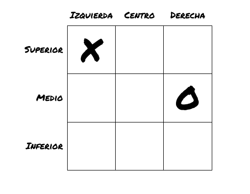
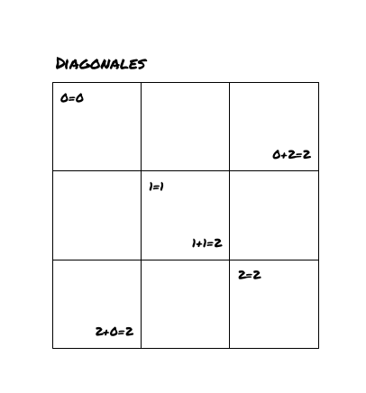

# Tarea corta #2

Curso IC-6821 Diseño de software  
Profesor Diego Munguía Molina

## Objetivos ##

* Aplicar el principio de abstracción en un ejercicio de programación orientada a objetos.
* Aplicar el principio de polimorfismo en un ejercicio de programación orientada a objetos.

## Guía de trabajo ##

Continuamos nuestro proyecto para implementar el juego X/O. Queremos aplicar algunas mejoras de diseño al código 
producido durante la tarea corta anterior. Lograremos estas mejoras aplicando los principios de programación 
orientada a objetos de abstracción y polimorfismo.

### Requerimiento 1 ###

El método para actuar sobre el tablero tiene la siguiente firma:

```java
MoveStatus applyMove(int row, int col, Token token);
```

Podemos notas que la abstracción para especificar fila y columna es muy general. Indica que ambas se representan como 
enteros. Esta representación tiene un rango muy amplio, incluyendo posibles valores como `-2730` o `65536`. En el caso 
de nuestro tablero los números `0`, `1` y `2` son suficientes para representar todas las posibilidades. Por esta razón
necesitamos métodos de validación para asegurarnos que los parámetros `row` y `col` estén dentro de los límites 
requeridos.

Podemos mejorar este diseño introduciendo una abstracción más específica y mejor adaptada a las características del 
problema que estamos modelando. Crearemos una abstracción que nos permita referirnos a las casillas del tablero por su 
posición relativa según se muestra en el siguiente diagrama:



Desde esta perspectiva podemos decir que la X se encuentra en la casilla superior izquierda en lugar de decir que está
en la casilla (0, 0). De la misma forma, la O se encuentra en la casilla medio derecha en lugar de decir (1, 2).

Los pares (0, 0) y (1, 2) son detalles de implementación, relacionados con el hecho de que el tablero se ha implementado
como una matriz. Tener que manejar este detalle fuera de la clase `Board` es también una forma de romper su 
encapsulamiento.

Necesitamos realizar los siguientes cambios:

1. Introducir dos enumeraciones `Row` y `Column` que contengan cada una sus correspondientes posiciones
   relativas, tal que podamos indicar por ejemplo `Row.MIDDLE` y `Column.RIGHT` en lugar de (1, 2).

2. Cambiar el método `applyMove` para que reciba estas enumeraciones en lugar de enteros:

```java
MoveStatus applyMove(Row row, Column col, Token token);
```

Con este cambio la validación de la posición se vuelve innecesaria. Es imposible colocar una ficha en una posición que 
no tenga sentido para el tablero, pues la combinación de `Row` y `Column` solo nos permite indicar una de nueve 
posibilidades válidas. 

La otra ventaja es que nos permite abstraer el detalle de implementación del tablero como matriz, de manera que hacia
afuera de la clase `Board` no tenemos que pensar en las casillas en términos de índices. Esto es apropiado porque 
permite mayor flexibilidad si en algún momento decidimos implementar el `Board` con base en alguna otra estructura de
datos.

### Requerimiento 2 ###

El principio de encapsulamiento nos permite esconder los datos que contiene un objeto, exponiendo únicamente su 
comportamiento. En otras palabras, un objeto nos debe permitir ver lo que hace, pero no lo que contiene.

En el caso de `Board` sus únicos miembros públicos son los métodos:

```java
MoveStatus applyMove(Row row, Column col, Token token);
String toString();
```

Por esta razón podemos introducir una nueva abstracción que nos permita describir al tablero únicamente a través de su
comportamiento.

Necesitamos aplicar entonces la siguiente refactorización:

1. Renombrar la clase `Board` a `MatrixBoard`. De esta forma indicamos que la clase representa un tablero 
   implementado como una matriz.
   
2. Crear una nueva interfaz que se llame `Board` y que contenga únicamente al método `applyMove`. El método `toString`
   existe por defecto en todo objeto y por lo tanto no es necesario especificarlo.
   
3. Indicar que `MatrixBoard` implementa a la interfaz `Board`. Así podemos referirnos a cualquier instancia de 
   `MatrixBoard` con una variable de tipo `Board` para esconder el detalle de su implementación como matriz (por ejemplo
   como se hace en la clase `TicTacToe` línea 8).  

### Requerimiento 3 ###

Ahora que hemos **desacoplado** el comportamiento del tablero de su implementación, podemos poner en práctica el 
principio de **polimorfismo** introduciendo una nueva implementación para `Board`.

Esta nueva implementación nos permitirá validar el estado del juego después de cada movida con complejidad temporal de
O(1).

Esto lo lograremos con un sistema de puntos. Llevaremos un contador de puntos para cada una de las tres filas, tres 
columnas y dos diagonales del tablero. 

Por simplicidad llamaremos *diagonal* a aquella que va de la esquina superior izquierda a la esquina inferior derecha,
y *anti-diagonal* a aquella que va de la esquina inferior izquierda a la esquina superior derecha.

Cada vez que colocamos una X sumamos un valor de `1` a los contadores de fila, 
columna y diagonal correspondiente, cuando colocamos una O sumamos un valor de `-1`. 

Por ejemplo si colocamos la ficha O en la posición superior derecha entonces sumamos `-1` a:

- el contador de la fila superior
- el contador de la columna derecha
- el contador de la anti-diagonal.

Después de colocar cada ficha actualizamos los contadores y verificamos sus valores, si alguno de los contadores llega a
`3` entonces X gana, si alguno llega a `-3` entonces O gana.

Para determinar si una casilla es parte de alguna diagonal podemos hacer uso de las siguientes propiedades:



Necesitamos implementar los siguientes cambios:

1. Crear una nueva clase `CountingBoard` que implemente a la interfaz `Board`.
   
2. Podemos implementar los contadores de filas como un `Map<Row, Integer>` y los contadores de columnas como un 
   `Map<Column, Integer>`. Los contadores para la diagonal y anti-diagonal pueden ser variables.
   
3. Para poder imprimir el tablero en pantalla todavía necesitamos llevar un registro de cuáles fichas se han colocado en 
   cuáles posiciones. Este requerimiento lo podemos implementar con un `Map<Pair<Row, Column>, Token>`.
   
Como vemos en el método `TicTacToe.main` las clases que implementan la interfaz `Board` se comportan de manera 
idéntica, a pesar de que su construcción interna sea radicalmente diferente. Este es el principio de polimorfismo en
acción.

Este ejercicio también se puede aprovechar para conocer más a fondo la estructura de datos `Map` que es ampliamente
utilizada. 

Para la implementación de `CountingBoard` pueden sacar provecho de los siguientes métodos de `Map`:

- `compute` que permite actualizar un valor en el `Map`, útil para actualizar los contadores
- `getOrDefault` que retorna el valor almacenado en el `Map` o un valor por defecto en caso de que la llave no esté en 
  el `Map`, útil para tratar como `0` a los contadores aún no inicializados

## Aspectos operativos ##

- No modificar ningún archivo de código ya existente en el repositorio, a menos de que se le solicite explícitamente en los requerimientos.
- No modificar ninguna prueba automatizada.
- No modificar ningún chequeo de estilo. 
- No utilizar spanglish.
- Escribir código limpio.
- Las pruebas de código verifican todos los requerimientos funcionales.
- Como entrega se considera el último `push` de código al repositorio antes de la revisión del trabajo.
- Puede encontrar información sobre cómo corregir problemas identificados por los chequeos de estilo en el siguiente 
  enlace: https://checkstyle.sourceforge.io/checks.html 

## Rúbrica ##

#### Total 10 pts #### 

#### Entrega (2 pts) ####
- (2 pts) El historial del repositorio contiene commits significativos de la persona estudiante.
- (0 pts) El historial del repositorio no contiene commits significativos de la persona estudiante. Si no hay commits 
  significativos, el resto de criterios no serán aplicados.

#### Chequeo de estilo (2 pts) ####
- (2 pts) El código en el repositorio pasa todos los chequeos de estilo.
- (0 pts) El código en el repositorio no pasa todos los chequeos de estilo.

#### Chequeo de diseño (3 pts) ####
- (3 pts) El código en el repositorio pasa todos los chequeos de diseño.
- (1 pts) El código en el repositorio pasa la mayoría de los chequeos de diseño.
- (0 pts) El código en el repositorio no pasa los chequeos de diseño.

#### Pruebas de código (3 pts)
- (3 pts) El código en el repositorio pasa todas las pruebas de código.
- (1 pts) El código en el repositorio pasa la mayoría de las pruebas de código.
- (0 pts) El código en el repositorio no pasa las pruebas de código.

